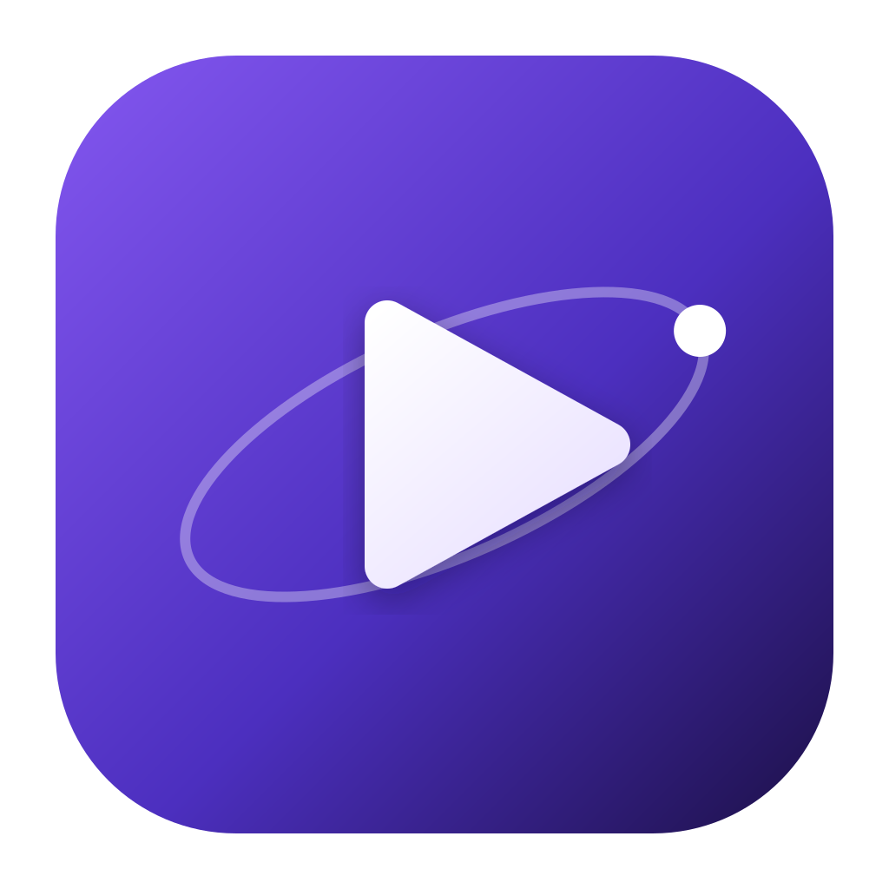

<div align="center">



# Gravitas

**A minimal, no-nonsense desktop client for Stremio addons.**<br />
Native Qt&nbsp;6 interface, its own Rust playback engine, and none of the Electron weight.

[](https://github.com/skyline69/gravitas/actions/workflows/ci.yml)
[](https://github.com/skyline69/gravitas/actions/workflows/release.yml)
[](https://github.com/skyline69/gravitas/releases/tag/rolling)
[](https://github.com/skyline69/gravitas/releases)
[](LICENSE)

[](https://www.python.org/)
[](https://doc.qt.io/qtforpython-6/)
[](native/player/README.md)
[](https://ffmpeg.org/)
[](#install)
[](https://mypy-lang.org/)
[](https://github.com/astral-sh/ruff)
[](https://github.com/astral-sh/uv)

[Features](#features) ·
[Screenshots](#screenshots) ·
[Install](#install) ·
[Build from source](#build-from-source) ·
[Development](#development) ·
[Architecture](#architecture)

</div>

---

## Features

<table>
<tr>
<td width="50%" valign="top">

### Stremio addons

- Install any addon by its manifest URL
- Catalogs, metadata and posters come from the addons themselves
- Cinemeta is installed on first run
- Opens `stremio://` links

</td>
<td width="50%" valign="top">

### Its own player

- Rust engine: FFmpeg, libplacebo, libass, cpal
- GPU decoding and zero-copy rendering (Vulkan on Linux, Metal on macOS)
- HDR tone mapping and **Dolby Vision, profile 5 included**
- Switching audio tracks is instant, with no re-buffering
- libmpv is still available as an alternative in Settings

</td>
</tr>
<tr>
<td valign="top">

### Watching

- Continue Watching, a watchlist and resume points
- Skip intro and skip recap; the next-episode card appears at the credits
- Subtitles from the file or from addons, with timing adjustment and your own style
- Audio and subtitle tracks picked by preferred language
- Picture-in-picture

</td>
<td valign="top">

### Streaming

- Parallel, cached network reading for debrid CDNs that limit each connection
- Seeking back and forth within what you've already watched plays straight from disk
- Recommends the source that suits your screen, connection and decoder
- If a source fails to open, the next one is tried automatically

</td>
</tr>
<tr>
<td valign="top">

### Discover

- Search across installed addons
- Discover board with filters
- External ratings on title pages

</td>
<td valign="top">

### Trakt

- Sign in with Trakt's device code
- Scrobbling while you watch
- Imports paused playback and watch history

</td>
</tr>
</table>

> [!NOTE]
> **No torrent engine, on purpose.** Gravitas plays direct HTTP/HLS links only. Torrents are resolved upstream, by the addon itself or by a debrid service (Real-Debrid, AllDebrid, TorBox, Premiumize, …).

## Screenshots

<div align="center">


</div>

## Install

Every push to the `release` branch builds all platforms into a single **[rolling release](https://github.com/skyline69/gravitas/releases/tag/rolling)**.

| Platform | Download | Notes |
| --- | --- | --- |
| **Linux** | `Gravitas-*.AppImage` · `Gravitas.flatpak` | libmpv and yt-dlp bundled |
| **macOS** | `Gravitas.dmg` | Rust engine bundled; ad-hoc signed: right-click → *Open* on first launch |
| **Windows 10/11 (x64)** | `Gravitas-Setup.exe` | Per-user install, no admin needed; registers `stremio://` links |
| **Windows 10/11 (x64)** | `Gravitas-windows-x64.zip` | Portable: unzip and run `gravitas.exe` (no `stremio://` handler) |

```bash
# Flatpak
flatpak install --user ./Gravitas.flatpak
flatpak run dev.skyline.Gravitas
```

<details>
<summary><b>Windows SmartScreen warning</b></summary>

<br />

The Windows binaries are not code-signed, so SmartScreen shows *"Windows protected your PC"* on first run. Click **More info → Run anyway**.

</details>

<details>
<summary><b>Where Gravitas keeps its files</b></summary>

<br />

| | Linux / macOS | Windows |
| --- | --- | --- |
| Settings | `$XDG_CONFIG_HOME/gravitas` | `%APPDATA%\Gravitas` |
| Progress and watchlist | `$XDG_DATA_HOME/gravitas` | `%LOCALAPPDATA%\Gravitas` |
| Caches (artwork, addon JSON) | `$XDG_CACHE_HOME/gravitas` | `%LOCALAPPDATA%\Gravitas\Cache` |

</details>

## Build from source

### Requirements

- **Python ≥ 3.12** and [**uv**](https://docs.astral.sh/uv/)
- A graphical session (X11, Wayland or a Windows desktop)
- **libmpv**, a system library rather than a pip package. It is needed for the mpv player, and as a fallback when the Rust engine is not built:

  | OS | Command |
  | --- | --- |
  | Fedora | `sudo dnf install mpv-libs` |
  | Debian / Ubuntu | `sudo apt install libmpv2` |
  | macOS | `brew install mpv` |
  | Windows | Get `libmpv-2.dll` from an [mpv-dev build](https://github.com/shinchiro/mpv-winbuild-cmake/releases), then put its folder on `%PATH%` or point `GRAVITAS_LIBMPV` at it |

- *Optional:* `yt-dlp` on `PATH` for YouTube-backed streams and trailers
- *Optional, for the Rust engine:* a Rust toolchain, plus FFmpeg, libplacebo and libass development packages (see [`native/player/README.md`](native/player/README.md))

### Run

```bash
uv sync                                        # install dependencies into .venv
uv run python scripts/build_native_player.py   # optional: build the Rust engine
uv run gravitas                                # launch
```

On first launch, Gravitas installs Cinemeta and fills the home screen from its catalogs. Add more addons in onboarding or under **Settings → Addons**.

### Package

```bash
uv run --with pyinstaller pyinstaller packaging/gravitas.spec --noconfirm
```

This produces `dist/Gravitas/` (Linux, Windows) or `dist/Gravitas.app` (macOS), with libmpv and yt-dlp inside. Then:

| Target | Command |
| --- | --- |
| AppImage | `bash packaging/build_appimage.sh` |
| Flatpak | `bash packaging/build_flatpak.sh` |
| macOS dmg | `create-dmg` (see [`release.yml`](.github/workflows/release.yml)) |
| Windows installer | `iscc packaging\windows\gravitas.iss` ([Inno Setup 6](https://jrsoftware.org/isdl.php)) |

On Windows the spec downloads `libmpv-2.dll` and `yt-dlp.exe` itself; unpacking the mpv archive needs 7-Zip or `py7zr`. Set `GRAVITAS_LIBMPV` to skip the download.

## Development

```bash
uv run pytest -q              # test suite (offline by design)
uv run ruff check .           # lint
uv run ruff format --check .  # format
uv run mypy src               # strict type check

# the Rust engine's own checks
(cd native/player && cargo clippy --workspace --all-targets && cargo test --workspace)
```

## Architecture

The code follows Clean Architecture, and each layer may depend only in the direction of the arrows:

```
presentation  →  application  →  domain  ←  infrastructure
   Qt / QML        use cases       pure        httpx, mpv,
                                  models       Rust engine
```

[`CLAUDE.md`](CLAUDE.md) holds the architecture notes and contributor guidance, including the platform quirks behind the design. [`native/player/README.md`](native/player/README.md) documents the playback engine's design and roadmap.

## License

[MIT](LICENSE) © Ö. Efe D. (skyline69)

<sub>Gravitas is an independent project and is not affiliated with Stremio. The format logos under <code>qml/formats/</code> are trademarks of their respective owners.</sub>
